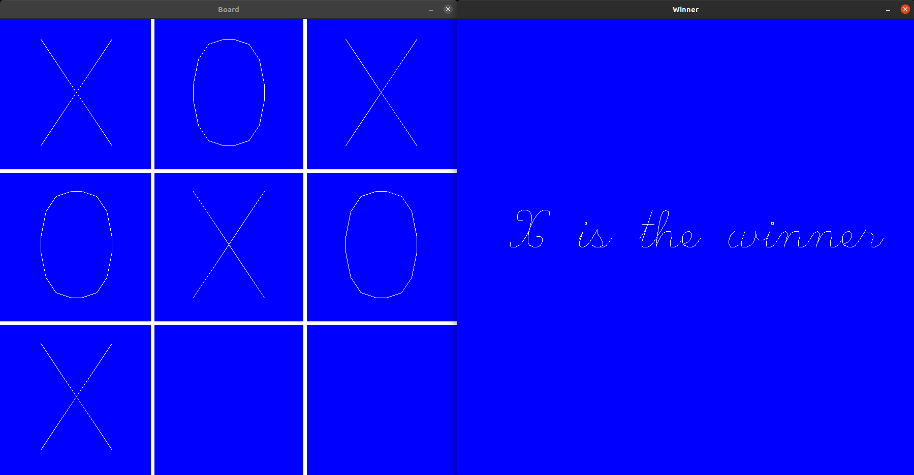
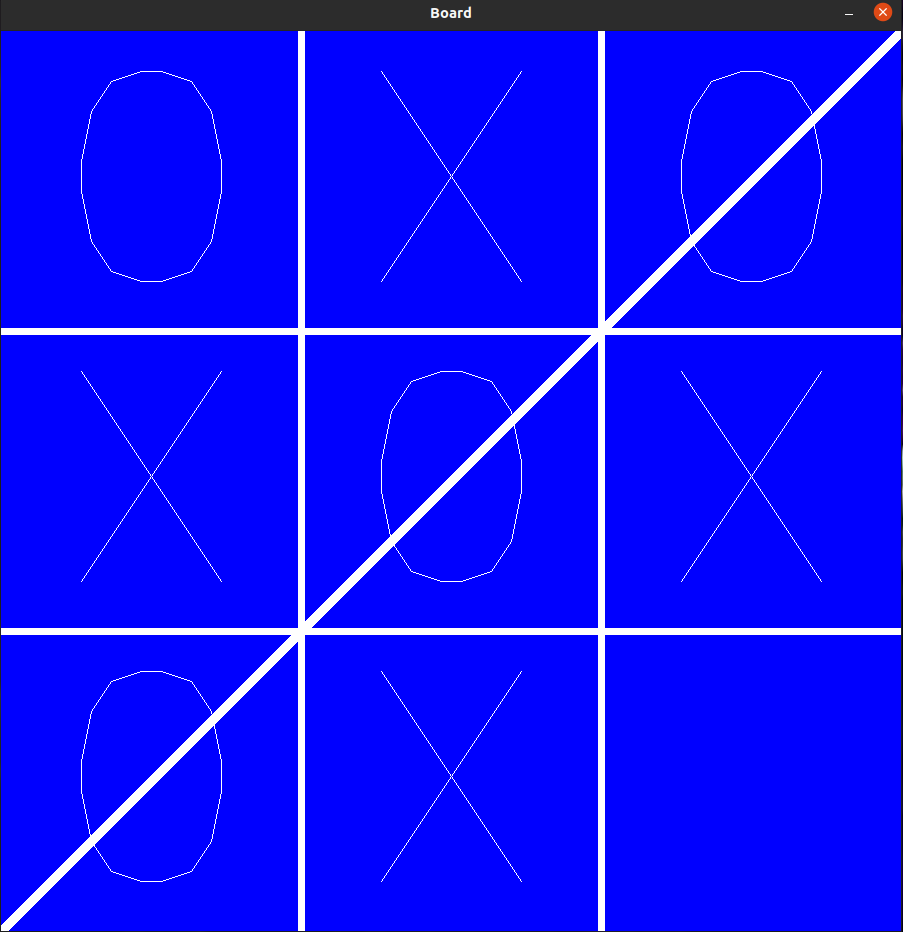

# TicTacToe

## **Build**

```
mkdir build
cd build
cmake ..
cmake --build . -- -j 4
```
## **Run**
```
./FinalTicTacToe
./FinalTicTacToe2
```

## **Output**
### FinalTicTacToe

### FinalTicTacToe2
